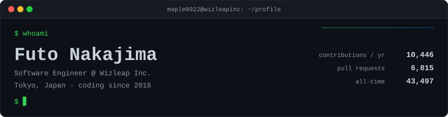
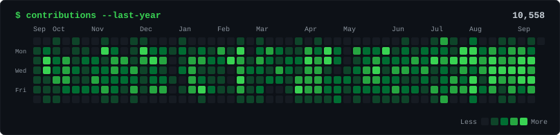
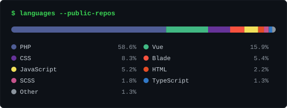

<div align="center">

<picture>
  <source media="(prefers-color-scheme: dark)" srcset="assets/header-dark.svg" />
  <source media="(prefers-color-scheme: light)" srcset="assets/header-light.svg" />
  
</picture>


<a href="https://github.com/Wizleap-Inc"></a>  

</div>

---

## `$ cat profile.json`

```console
$ cat profile.json
{
  "role":     "Software Engineer",
  "company":  "Wizleap Inc.",
  "location": "Tokyo, Japan",
  "since":    2018,
  "building": ["insurance CRM", "internal tooling", "AI agents on Slack"],
  "stack":    ["PHP / Laravel", "Vue / Nuxt", "TypeScript", "Go", "AWS"],
  "bio":      "フロントエンドわからん"
}

$ tail -n 3 ~/.notes
- 保険CRM (crm-expert / crm-market-holder) をひたすら育てている
- 手作業を見つけたら自動化する。データ移行もQAもぜんぶ
- 最近は Claude Code に仕事を任せる仕組みづくりに夢中
```

---

## `$ gh contributions`

<!-- STATS:START -->
```console
$ gh contributions --user Maple0922 --include-private

╭─ SUMMARY ───────────────────────────────────────────────────╮
│ Contributions (last 365 days) ······················ 10,226 │
│ Contributions (all time) ··························· 43,153 │
│ Contributions (last 30 days) ························ 1,276 │
│ Pull requests opened ································ 6,695 │
│ Issues opened ········································· 198 │
│ Repositories contributed to ···························· 29 │
│                                                             │
│ Current streak ····································· 4 days │
│ Longest streak ···································· 30 days │
│ Active days ········································· 1,693 │
│ Busiest day ······························ 2023-01-15 (175) │
╰─────────────────────────────────────────────────────────────╯

╭─ BY YEAR ───────────────────────────────────────────────────╮
│ 2018  ░░░░░░░░░░░░░░░░░░░░░░░░░░░░░░░░░░░░░░░░░░░░      1   │
│ 2019  ░░░░░░░░░░░░░░░░░░░░░░░░░░░░░░░░░░░░░░░░░░░░     23   │
│ 2020  █░░░░░░░░░░░░░░░░░░░░░░░░░░░░░░░░░░░░░░░░░░░    277   │
│ 2021  ██████████████████░░░░░░░░░░░░░░░░░░░░░░░░░░  3,690   │
│ 2022  ████████████████████████████████████████████  8,879   │
│ 2023  ████████████████████████████████████████░░░░  8,110   │
│ 2024  █████████████████████████████████░░░░░░░░░░░  6,749   │
│ 2025  ██████████████████████████████████████░░░░░░  7,711   │
│ 2026  ██████████████████████████████████████░░░░░░  7,713 ← │
╰─────────────────────────────────────────────────────────────╯

╭─ LAST 12 MONTHS ────────────────────────────────────────────╮
│    ▄  ▅  ▅  ▄  ▄  ▄  ▇  ▅  ▅  █  █  ▃                       │
│   10 11 12 01 02 03 04 05 06 07 08 09                       │
│                                                             │
│   peak 2026-08 (1,365)  ·  avg 851 / month                  │
│   * the rightmost month is still in progress                │
╰─────────────────────────────────────────────────────────────╯
```

<sub>🤖 Auto-generated from the GitHub GraphQL API · last run 2026-09-10 03:00 UTC</sub>
<!-- STATS:END -->

<div align="center">

<picture>
  <source media="(prefers-color-scheme: dark)" srcset="assets/contributions-dark.svg" />
  <source media="(prefers-color-scheme: light)" srcset="assets/contributions-light.svg" />
  
</picture>

</div>

---

## `$ cat stack.txt`

<div align="center">


<br />


<br /><br />

<picture>
  <source media="(prefers-color-scheme: dark)" srcset="assets/languages-dark.svg" />
  <source media="(prefers-color-scheme: light)" srcset="assets/languages-light.svg" />
  
</picture>

</div>

```console
$ stack --sort=usage

Backend    PHP · Laravel · Go · Python
Frontend   Vue · Nuxt · TypeScript · Vite
Infra      AWS (ECS / Lambda / RDS) · Docker · Vercel · GitHub Actions
Data       MySQL · Redash · 大規模データ移行
Agents     Claude Code · Slack Bot · Notion API
Editor     Vim (vimmerになりたい)
```

---

## `$ ./snake.sh`

<div align="center">

<picture>
  <source media="(prefers-color-scheme: dark)" srcset="https://raw.githubusercontent.com/Maple0922/Maple0922/output/github-snake-dark.svg" />
  <source media="(prefers-color-scheme: light)" srcset="https://raw.githubusercontent.com/Maple0922/Maple0922/output/github-snake.svg" />
  
</picture>

</div>

---

<div align="center">


<sub><code>$ exit</code> — thanks for stopping by 👋</sub>

</div>
